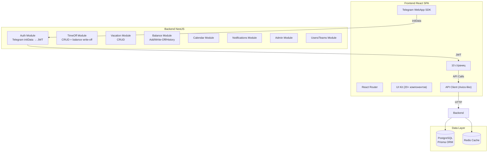
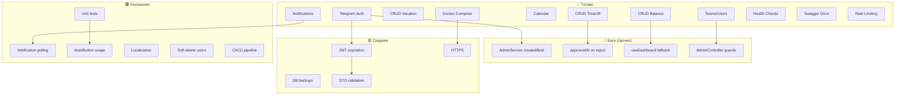

# QA TimeOff — Аудит продукта и план доработок

## 1. Текущее состояние

### 1.1 Архитектура



### 1.2 Функциональность (что уже работает)

- [x] Telegram Mini App авторизация (initData → JWT)
- [x] Dashboard (сводка пользователя)
- [x] Отгулы (создание, просмотр, одобрение, отклонение, отмена)
- [x] Отпуска (создание, просмотр, одобрение, отклонение, отмена)
- [x] Баланс часов (начисление, списание, история операций)
- [x] Календарь команды (одобренные и pending события)
- [x] Команды (CRUD)
- [x] Пользователи (CRUD, роли)
- [x] Уведомления (модель, чтение)
- [x] Swagger документация
- [x] Health checks (DB, memory, disk)
- [x] Docker Compose (Postgres, Redis, Backend, Frontend, Nginx)
- [x] Rate limiting
- [x] Логирование (Winston)
- [x] CORS
- [x] Helmet

---

## 2. 🔴 Критические проблемы (баги)

### 2.1 Backend: `admin.service.ts` — неверный `createdById`

**Файл**: [`apps/backend/src/admin/admin.service.ts`](apps/backend/src/admin/admin.service.ts:21)

```typescript
// Строка 21 — БАГ: createdById = userId (целевой пользователь)
await tx.balanceOperation.create({
    data: { userId, operationType: BalanceOperationType.ADD, hours, reason: comment, createdById: userId },
    //                                                                                    ^^^^^^^^
    // Должно быть createdById: currentUser.id (администратор, который совершает операцию)
});
```

**Последствия**: В истории операций будет указано, что операцию выполнил сам пользователь, а не администратор.

**Исправление**: Передать `currentUser` в методы `accrue()` и `writeOff()`.

### 2.2 Backend: `Reject` устанавливает `approvedAt`

**Файлы**:
- [`apps/backend/src/timeoff/timeoff.service.ts`](apps/backend/src/timeoff/timeoff.service.ts:153)
- [`apps/backend/src/vacation/vacation.service.ts`](apps/backend/src/vacation/vacation.service.ts:130)

```typescript
// При отклонении заявки устанавливается approvedAt
data: {
    status: RequestStatus.REJECTED,
    approverId: currentUser.id,
    approverComment,
    approvedAt: new Date(),  // <-- БАГ: wrong field for rejection
},
```

**Последствия**: В БД будет записана дата "одобрения" для отклоненной заявки.

**Исправление**: Убрать `approvedAt` при rejection. Либо использовать `updatedAt` (автоматически).

### 2.3 Frontend: useDashboard() возвращает `{}` при отсутствии данных

**Файл**: [`apps/frontend/src/shared/hooks/useDashboard.ts`](apps/frontend/src/shared/hooks/useDashboard.ts:19)

```typescript
dashboard: (query.data ?? {}) as Dashboard,  // {} as Dashboard — любой доступ к свойству упадет
```

**Последствия**: Если query disabled и нет данных, любая страница, использующая `dashboard.requests.map()` или `dashboard.user.fullName`, упадет с `Cannot read properties of undefined`.

**Исправление**: Использовать fallback с default-значениями вместо пустого объекта, либо проверять `query.data` перед использованием.

### 2.4 AdminController не передает currentUser

**Файл**: [`apps/backend/src/admin/admin.controller.ts`](apps/backend/src/admin/admin.controller.ts)

Нет `@UseGuards(JwtAuthGuard)` и нет `@CurrentUser()` параметра, хотя `Dockerfile` намекает на их наличие. Админские эндпоинты не защищены — любой может вызвать.

**Исправление**: Добавить `@UseGuards(JwtAuthGuard, RolesGuard)` и `@Roles(Role.ADMIN)` на admin controller.

---

## 3. 🟡 Средние проблемы (не критично, но важно)

### 3.1 Нет refresh token механизма

**Файл**: [`apps/backend/src/auth/auth.service.ts`](apps/backend/src/auth/auth.service.ts:30)

JWT токен не имеет expiration (генерируется без `expiresIn`). Если токен скомпрометирован — нет способа его отозвать.

**Исправление**:
- Добавить `expiresIn: '24h'` для access token
- Добавить refresh token (опционально, можно в v2)

### 3.2 Отпуска не проверяют баланс

При одобрении отпуска баланс часов не уменьшается. Возможно, это intentional (отпуска — отдельная история), но должно быть явно задокументировано в коде и UI.

### 3.3 Нет WebSocket/polling для уведомлений

Уведомления создаются в БД, но пользователь видит их только при загрузке dashboard или страницы уведомлений. Нет push-уведомлений или polling для real-time обновления.

**Исправление**: Добавить polling (каждые 30-60s) или WebSocket (v2).

### 3.4 Swagger: не все эндпоинты документированы

Некоторые контроллеры (например, `admin.controller.ts`) могут не иметь `@ApiTags`, `@ApiBearerAuth`, `@ApiOperation`.

### 3.5 Нет валидации DTO на некоторых эндпоинтах

**Файл**: [`apps/backend/src/admin/dto/balance-operation.dto.ts`](apps/backend/src/admin/dto/balance-operation.dto.ts)

Проверить наличие `class-validator` декораторов на всех DTO.

### 3.6 Docker Compose: нет HTTPS

```yaml
# nginx слушает порт 80 без SSL
ports:
  - "${APP_PORT:-8080}:80"
```

Telegram Mini App требует HTTPS.

**Исправление**: Добавить Traefik/Caddy reverse proxy или настроить certbot.

---

## 4. 🟢 Улучшения (nice to have)

### 4.1 Frontend: Production сборка

- [ ] Добавить `.env.production` с `VITE_API_URL=/api`
- [ ] Проверить, что все `console.log` убраны
- [ ] Минификация и code splitting (Vite делает это по умолчанию)

### 4.2 Frontend: Локализация

Текст на русском, но некоторые строки все еще на английском:
- `New time off request` → `Новая заявка на отгул`
- `Time off approved` → `Отгул согласован`
- `Insufficient balance hours` → `Недостаточно часов на балансе`

### 4.3 Backend: Удаление пользователя

`DELETE /users/:id` — нужно добавить каскадное удаление или soft-delete.

**Prisma schema**: `onDelete: Cascade` настроен для большинства связей, но `BalanceOperation.createdBy` имеет `onDelete: Restrict`.

### 4.4 Frontend: Callback для основных кнопок Telegram

Telegram Mini App имеет `MainButton`, который можно использовать для основных действий (создать заявку, сохранить). Сейчас `useTelegramMainButton` существует, но не используется на страницах (например, [`CreateTimeOffPage.tsx`](apps/frontend/src/pages/CreateTimeOffPage.tsx), [`CreateVacationPage.tsx`](apps/frontend/src/pages/CreateVacationPage.tsx)).

### 4.5 Prisma: Миграции

Есть одна миграция `20260520090000_init_timeoff_schema`. Нужна вторая миграция, если будут изменения схемы.

### 4.6 Docker: Multi-stage build оптимизация

```dockerfile
# apps/backend/Dockerfile — копирует весь node_modules
COPY --from=builder /app/node_modules ./node_modules
COPY --from=builder /app/apps/backend/node_modules apps/backend/node_modules
```

Prisma CLI не нужен в runtime, достаточно Prisma Client. Можно уменьшить размер образа.

---

## 5. Тестирование

### 5.1 Backend тесты

```bash
npm run test --workspace @qa-timeoff/backend
# или
cd apps/backend && npx jest
```

**Текущее покрытие**: Есть `jest.config.ts`, но файлы `.spec.ts` или `.test.ts` отсутствуют в проекте (кроме `env.validation.spec.ts`).

**Что нужно покрыть**:
- AuthService (telegramLogin, getProfile)
- TimeOffService (create, approve, reject, cancel)
- VacationService (create, approve, reject, cancel)
- BalanceService (add, writeOff, getOperations)
- CalendarService
- RolesGuard, JwtAuthGuard
- Validation (DTOs)

### 5.2 Frontend тесты

```bash
npm run test --workspace @qa-timeoff/frontend
# или
cd apps/frontend && npx vitest run
```

**Текущее покрытие**: Есть `vitest.config.ts`, но тестовые файлы (`*.test.tsx`, `*.spec.tsx`) отсутствуют.

**Что нужно покрыть**:
- UI компоненты (Button, Card, Badge, Modal, etc.)
- Страницы (ключевые flows: создание заявки, approve/reject)
- API client (mock fetch)
- Telegram utils (getTelegramInitData, setupTelegramApp)

---

## 6. 🚀 План работ по приоритетам

### Фаза 1: Bug fixes (срочно)
| # | Задача | Файл(ы) | Оценка |
|---|--------|---------|--------|
| 1 | Исправить `createdById` в AdminService | [`admin.service.ts`](apps/backend/src/admin/admin.service.ts) | малый |
| 2 | Убрать `approvedAt` при rejection | [`timeoff.service.ts`](apps/backend/src/timeoff/timeoff.service.ts), [`vacation.service.ts`](apps/backend/src/vacation/vacation.service.ts) | малый |
| 3 | Исправить `useDashboard()` fallback | [`useDashboard.ts`](apps/frontend/src/shared/hooks/useDashboard.ts) | малый |
| 4 | Добавить guards на AdminController | [`admin.controller.ts`](apps/backend/src/admin/admin.controller.ts) | малый |

### Фаза 2: Production readiness
| # | Задача | Файл(ы) | Оценка |
|---|--------|---------|--------|
| 5 | JWT expiration (24h) + refresh token | [`auth.service.ts`](apps/backend/src/auth/auth.service.ts) | средняя |
| 6 | HTTPS через Caddy/Traefik в Docker Compose | [`docker-compose.yml`](docker-compose.yml) | средняя |
| 7 | Автоматический backup БД | cron + pg_dump | малый |
| 8 | Настроить rate limit для Telegram endpoints | [`app.module.ts`](apps/backend/src/app.module.ts) | малый |

### Фаза 3: Качество кода
| # | Задача | Файл(ы) | Оценка |
|---|--------|---------|--------|
| 9 | Написать тесты для Backend (jest) | `*.spec.ts` | большая |
| 10 | Написать тесты для Frontend (vitest) | `*.test.tsx` | большая |
| 11 | Добавить валидацию DTO (class-validator) | `dto/*.ts` | средняя |
| 12 | Swagger документация для всех эндпоинтов | Controllers | средняя |

### Фаза 4: Функциональные улучшения
| # | Задача | Файл(ы) | Оценка |
|---|--------|---------|--------|
| 13 | Polling уведомлений (30s) | [`notifications/`](apps/backend/src/notifications/), [`AppLayout.tsx`](apps/frontend/src/components/layout/AppLayout.tsx) | средняя |
| 14 | Использовать MainButton Telegram на страницах создания | [`CreateTimeOffPage.tsx`](apps/frontend/src/pages/CreateTimeOffPage.tsx), [`CreateVacationPage.tsx`](apps/frontend/src/pages/CreateVacationPage.tsx) | средняя |
| 15 | Локализация английских строк | Backend + Frontend | средняя |
| 16 | Soft-delete для пользователей | Prisma schema + UsersService | средняя |

---

## 7. Итоговая диаграмма состояния



---

## 8. Как запускать проверки

```bash
# Backend тесты
npm run test --workspace @qa-timeoff/backend

# Frontend тесты
npm run test --workspace @qa-timeoff/frontend

# Линтер
npm run lint

# Docker сборка (проверка что собирается)
docker compose build

# Полный запуск
docker compose up -d --build
```
