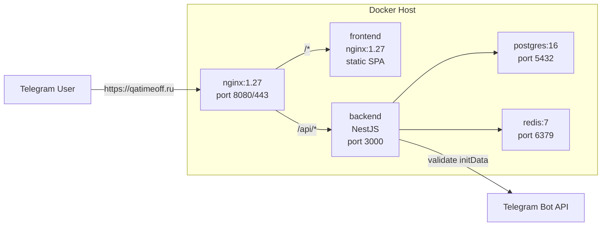
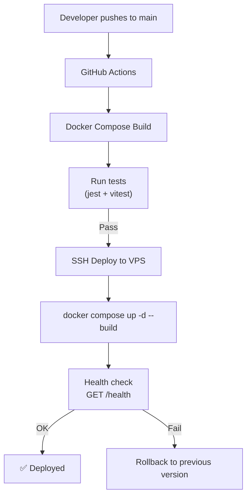

# QA TimeOff — Production Deployment Plan

## 1. Текущее состояние проекта

### Изученная кодовая база

| Компонент | Технологии | Статус |
|-----------|-----------|--------|
| Frontend | React 18, Vite, TypeScript, TailwindCSS, TanStack Query, React Router | 🟡 Есть UI, требуется проверка |
| Backend | NestJS, TypeScript, Prisma, PostgreSQL, Redis, JWT, Swagger | 🟡 Есть API, требуется проверка |
| Docker Compose | Postgres 16, Redis 7, Backend, Frontend (Nginx), Nginx reverse proxy | ✅ Готов |
| Telegram Integration | Telegram WebApp SDK, HMAC-валидация initData | ✅ Готов |
| Dev Mode | Мок Telegram WebApp, bypass авторизации | ✅ Добавлен |

### Архитектура деплоя (текущая)



---

## 2. Чек-лист подготовки к продакшену

### 2.1 Инфраструктура

- [ ] **Выбор хостинга**: VPS (Linux, 2GB RAM+, Docker 24+)
  - Варианты: RuVDS, Timeweb, Selectel (для РФ)
  - Hetzner, DigitalOcean (для EU)
- [ ] **Домен**: `qatimeoff.ru` (или другой) с доступом к DNS-панели
- [ ] **SSL/TLS**: Let's Encrypt через certbot или Traefik/Caddy
- [ ] **HTTPS**: Обязателен для Telegram Mini App (Telegram требует HTTPS)
- [ ] **Docker-окружение**: Docker 24+ и Docker Compose v2 на сервере

### 2.2 Telegram Bot

- [ ] Создать бота через [@BotFather](https://t.me/BotFather)
  - Команда `/newbot` → получить `TELEGRAM_BOT_TOKEN`
- [ ] Настроить Mini App в BotFather:
  - `/mybots` → выбрать бота → `Bot Settings` → `Menu Button` → уставить URL `https://qatimeoff.ru`
  - Или через `Bot Settings` → `Domain` → указать домен
- [ ] Записать `TELEGRAM_BOT_TOKEN` в `.env`

### 2.3 База данных

- [ ] Настроить регулярные backup PostgreSQL:
  ```bash
  # Пример cron: ежедневно в 3:00
  0 3 * * * docker exec qa-timeoff-postgres pg_dump -U qa_timeoff qa_timeoff | gzip > /backups/qa_timeoff_$(date +\%Y\%m\%d).sql.gz
  ```
- [ ] Настроить мониторинг размера БД
- [ ] Проверить retention policy для данных

### 2.4 Переменные окружения (продакшен `.env`)

```env
# Порты
APP_PORT=443              # или 8080 с reverse proxy
BACKEND_PORT=3000

# БД
POSTGRES_DB=qa_timeoff
POSTGRES_USER=qa_timeoff
POSTGRES_PASSWORD=<сгенерировать сложный пароль>

# Backend
JWT_SECRET=<64+ символов, openssl rand -hex 32>
TELEGRAM_BOT_TOKEN=<токен от BotFather>
ADMIN_TELEGRAM_ID=<Telegram ID первого админа>
RUN_SEED=false             # false после первого запуска

# CORS
FRONTEND_URL=https://qatimeoff.ru
CORS_ORIGIN=https://qatimeoff.ru
ALLOWED_ORIGINS=https://qatimeoff.ru,https://www.qatimeoff.ru

# Rate limiting (можно увеличить для прода)
RATE_LIMIT_TTL=60
RATE_LIMIT_MAX=200

# Логи
LOG_LEVEL=warn             # меньше логов в продакшене
LOG_DIR=/var/log/qa-timeoff

# Кэш
CACHE_TTL=300
REDIS_URL=redis://redis:6379

# Frontend (сборка)
VITE_API_URL=/api
```

### 2.5 Nginx — HTTPS (через reverse proxy)

**Вариант A**: Отдельный nginx/caddy/traefik на хосте

Конфигурация для Caddy (рекомендуется, авто-HTTPS):

```caddy
qatimeoff.ru {
    reverse_proxy localhost:8080
}
```

Конфигурация для nginx с certbot:

```nginx
server {
    listen 443 ssl http2;
    server_name qatimeoff.ru www.qatimeoff.ru;

    ssl_certificate /etc/letsencrypt/live/qatimeoff.ru/fullchain.pem;
    ssl_certificate_key /etc/letsencrypt/live/qatimeoff.ru/privkey.pem;

    location / {
        proxy_pass http://localhost:8080;
        proxy_set_header Host $host;
        proxy_set_header X-Real-IP $remote_addr;
        proxy_set_header X-Forwarded-For $proxy_add_x_forwarded_for;
        proxy_set_header X-Forwarded-Proto $scheme;
    }
}
```

**Вариант B**: Traefik как reverse proxy в Docker Compose (встроенный ACME)

---

## 3. Этапы деплоя

### Шаг 1: Подготовка сервера

```bash
# Установка Docker
curl -fsSL https://get.docker.com | sh

# Установка Docker Compose v2
sudo apt-get install docker-compose-plugin

# Клонирование репозитория
git clone https://github.com/ваш-репозиторий/qa_timeoff.git /opt/qa_timeoff
cd /opt/qa_timeoff
```

### Шаг 2: Настройка окружения

```bash
cp .env.example .env
# Отредактировать .env — вставить TELEGRAM_BOT_TOKEN, JWT_SECRET, пароль БД
nano .env
```

### Шаг 3: Запуск

```bash
# Первый запуск с seed
RUN_SEED=true docker compose up -d --build

# Проверка
docker compose ps
docker compose logs backend
```

### Шаг 4: SSL

```bash
# Установка certbot
sudo apt-get install certbot python3-certbot-nginx

# Получение сертификата
sudo certbot --nginx -d qatimeoff.ru -d www.qatimeoff.ru
```

### Шаг 5: Проверка интеграции с Telegram

1. Открыть Telegram → бот → нажать кнопку Menu или Launch
2. Должен открыться Mini App по URL `https://qatimeoff.ru`
3. Проверить авторизацию — initData должна передаваться корректно

---

## 4. Что нужно доделать

### 4.1 Frontend

- [ ] **UI/UX доработки**:
  - Проверить отображение всех состояний (загрузка, ошибка, пусто) на всех страницах
  - Адаптация под Telegram theme (dark/light mode)
  - Обработка Telegram BackButton на всех страницах
- [ ] **Ошибки**:
  - Страница `ManagerRequestsPage.tsx` — проверить работу согласования заявок
  - `CalendarPage.tsx` — проверить фильтрацию по командам
  - `AdminPage.tsx` — проверить CRUD пользователей
- [ ] **Локализация**: Проверить что весь UI на русском
- [ ] **Доступность**: Telegram WebApp guidelines (правильные safe-area insets)

### 4.2 Backend

- [ ] **Проверить эндпоинты**:
  - `POST /admin/accruals` — начисление часов админом
  - `POST /admin/write-offs` — списание часов админом
- [ ] **Уведомления**: Механизм создания уведомлений при изменениях статуса заявок (сейчас есть модель `Notification`, но нужна проверка бизнес-логики)
- [ ] **Rate limiting**: Проверить что throttler корректно работает за reverse proxy (уже есть `ThrottlerBehindProxyGuard`)
- [ ] **Swagger**: Проверить что все эндпоинты документированы (проверить декораторы `@ApiTags`, `@ApiBearerAuth`)

### 4.3 Безопасность

- [ ] **JWT expiration**: Добавить refresh token механизм (сейчас только access token)
- [ ] **CORS**: Проверить настройки для продакшен-домена
- [ ] **Helmet**: Проверить настройки helmet в `main.ts`
- [ ] **Secrets management**: Не хранить секреты в git, использовать `.env`

### 4.4 Тестирование

- [ ] **Frontend**: Запустить `vitest` — проверить текущие тесты, добавить если отсутствуют
- [ ] **Backend**: Запустить `jest` — проверить тесты
- [ ] **E2E**: Ручное тестирование всех flows:
  1. Создание отгула → ожидание → одобрение/отклонение
  2. Создание отпуска → ожидание → одобрение/отклонение
  3. Управление балансом (ADD/WRITE_OFF)
  4. Календарь команды
  5. Админка: управление пользователями и командами

### 4.5 Мониторинг и логи

- [ ] **Backend логи**: Winston пишет в `logs/`, проверить ротацию логов
- [ ] **Health check**: `GET /health` (NestJS Terminus) — добавить в мониторинг
- [ ] **Docker healthchecks**: Уже настроены для postgres, redis, backend
- [ ] **ALERTS**: Добавить уведомления о падении сервисов (например, через Uptime Kuma или аналоги)

---

## 5. CI/CD Pipeline (Рекомендация)

```yaml
name: Deploy

on:
  push:
    branches: [main]

jobs:
  deploy:
    runs-on: ubuntu-latest
    steps:
      - uses: actions/checkout@v4
      - name: Build & Deploy
        run: |
          docker compose build
          docker compose up -d
```

Или использовать `deploy_test.txt` (уже есть в проекте) для тестового деплоя.

---

## 6. Мониторинг после деплоя

### Проверить:

```bash
# Статус контейнеров
docker compose ps

# Логи бэкенда
docker compose logs --tail=100 backend

# Использование ресурсов
docker stats

# Healthcheck
curl -s http://localhost:3000/health
curl -s http://localhost:8080/health
```

### Метрики для отслеживания:

| Метрика | Инструмент |
|---------|-----------|
| CPU/RAM контейнеров | `docker stats` |
| Логи ошибок | Winston logs → ELK/Grafana или просто `journalctl` |
| Доступность | Uptime Kuma / Pingdom |
| Telegram initData成功率 | Логи backend: "Telegram auth request" |
| База данных | Размер, количество подключений |

---

## 7. Схема deploy pipeline



---

## 8. Ссылки

- [Telegram Mini App Documentation](https://core.telegram.org/bots/webapps)
- [NestJS Documentation](https://docs.nestjs.com/)
- [Prisma Deployment](https://www.prisma.io/docs/orm/prisma-client/deployment)
- [Vite Deployment](https://vite.dev/guide/static-deploy)
