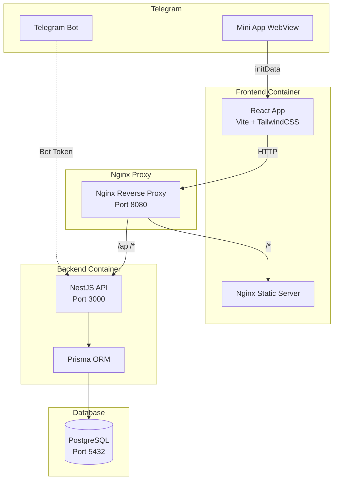
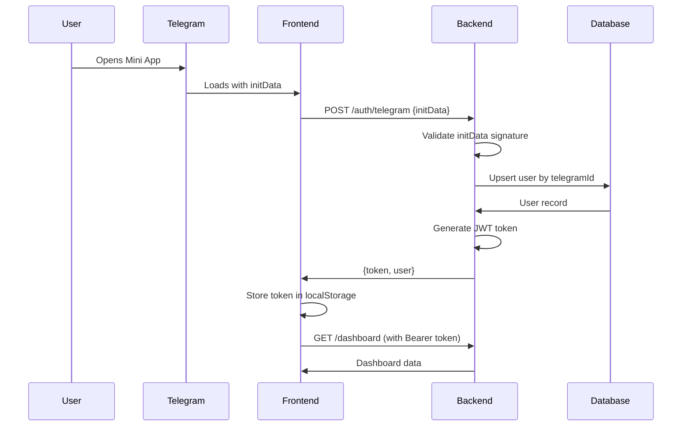

# QA TimeOff Mini App - Project Analysis

## Executive Summary

**QA TimeOff** is a Telegram Mini App designed for managing QA team absences, including time-off requests, vacations, sick leaves, hour balances, request approvals, team calendar, and user administration.

## Technology Stack

### Frontend
- **Framework**: React 18 with TypeScript
- **Build Tool**: Vite
- **Styling**: TailwindCSS
- **Routing**: React Router v7
- **State Management**: Zustand + TanStack Query (React Query)
- **Telegram Integration**: @telegram-apps/sdk-react
- **UI Components**: Custom components with Lucide React icons
- **Date Handling**: date-fns

### Backend
- **Framework**: NestJS with TypeScript
- **Database**: PostgreSQL with Prisma ORM
- **Authentication**: JWT + Telegram WebApp validation
- **API Documentation**: Swagger/OpenAPI
- **Validation**: class-validator, class-transformer

### Infrastructure
- **Containerization**: Docker + Docker Compose
- **Reverse Proxy**: Nginx
- **Monorepo**: npm workspaces
- **Database Migrations**: Prisma Migrate

## Architecture Overview



## Project Structure

```
qa_timeoff/
├── apps/
│   ├── backend/              # NestJS API
│   │   ├── prisma/
│   │   │   ├── schema.prisma # Database schema
│   │   │   ├── migrations/   # Database migrations
│   │   │   └── seed.ts       # Test data seeding
│   │   └── src/
│   │       ├── admin/        # Admin operations
│   │       ├── auth/         # Authentication & authorization
│   │       ├── balance/      # Hour balance management
│   │       ├── calendar/     # Team calendar
│   │       ├── dashboard/    # User dashboard
│   │       ├── notifications/# Notification system
│   │       ├── requests/     # Generic requests
│   │       ├── teams/        # Team management
│   │       ├── timeoff/      # Time-off requests
│   │       ├── users/        # User management
│   │       └── vacation/     # Vacation requests
│   └── frontend/             # React Telegram Mini App
│       └── src/
│           ├── app/          # App setup, router, providers
│           ├── components/   # Reusable UI components
│           ├── entities/     # Domain entities
│           ├── pages/        # Page components
│           ├── shared/       # Shared utilities
│           │   ├── api/      # API client
│           │   ├── hooks/    # Custom hooks
│           │   ├── types/    # TypeScript types
│           │   └── utils/    # Utility functions
│           └── store/        # State management
├── packages/
│   └── shared/               # Shared types/utilities (extensible)
└── infra/
    └── nginx.conf            # Nginx configuration
```

## Database Schema

### Core Models

#### User
- **Fields**: id, telegramId, fullName, username, email, position, role, teamId, managerId, isActive
- **Relations**: team, manager, directReports, timeBalance, balanceOperations, requests, notifications
- **Roles**: EMPLOYEE, LEAD, MANAGER, ADMIN

#### Team
- **Fields**: id, name, description
- **Relations**: users

#### TimeBalance
- **Fields**: id, userId, balanceHours, totalAddedHours, totalUsedHours
- **Relations**: user (1:1)

#### BalanceOperation
- **Fields**: id, userId, operationType, hours, reason, createdById
- **Types**: ADD, WRITE_OFF, MANUAL_CORRECTION, EXPIRED
- **Relations**: user, createdBy

#### TimeOffRequest
- **Fields**: id, userId, date, hours, reason, comment, status, approverId, approverComment, approvedAt
- **Status**: DRAFT, PENDING, APPROVED, REJECTED, CANCELLED
- **Relations**: user, approver

#### VacationRequest
- **Fields**: id, userId, startDate, endDate, daysCount, vacationType, status, comment, approverId, approverComment, approvedAt
- **Types**: ANNUAL, UNPAID, SICK_LEAVE, OTHER
- **Relations**: user, approver

#### Notification
- **Fields**: id, userId, title, message, type, isRead
- **Relations**: user

## Authentication Flow



## API Endpoints

### Authentication
- `POST /auth/telegram` - Login via Telegram initData
- `GET /auth/me` - Get current user profile

### Dashboard
- `GET /dashboard` - User dashboard summary

### Time Off
- `POST /timeoff/request` - Create time-off request
- `GET /timeoff/my` - Get user's time-off requests
- `GET /timeoff/pending` - Get pending team requests
- `PATCH /timeoff/:id/approve` - Approve request
- `PATCH /timeoff/:id/reject` - Reject request
- `PATCH /timeoff/:id/cancel` - Cancel request

### Vacation
- `POST /vacation/request` - Create vacation request
- `GET /vacation/my` - Get user's vacations
- `GET /vacation/pending` - Get pending vacations
- `PATCH /vacation/:id/approve` - Approve vacation
- `PATCH /vacation/:id/reject` - Reject vacation
- `PATCH /vacation/:id/cancel` - Cancel vacation

### Calendar
- `GET /calendar` - Get calendar events
- `GET /calendar/team/:teamId` - Get team calendar
- `GET /calendar/user/:userId` - Get user calendar

### Balance
- `GET /balance/me` - Get user balance
- `GET /balance/user/:userId` - Get specific user balance
- `POST /balance/add` - Add hours to balance
- `POST /balance/write-off` - Write off hours
- `GET /balance/operations` - Get balance operations
- `GET /balance/operations/:userId` - Get user operations

### Users & Teams
- `GET /users`, `POST /users`, `PATCH /users/:id`, `DELETE /users/:id`
- `GET /teams`, `POST /teams`, `PATCH /teams/:id`, `DELETE /teams/:id`

### Notifications
- `GET /notifications` - Get user notifications
- `PATCH /notifications/:id/read` - Mark as read
- `PATCH /notifications/read-all` - Mark all as read

### Admin
- `POST /admin/accruals` - Bulk hour accruals
- `POST /admin/write-offs` - Bulk hour write-offs

## Role-Based Access Control

### EMPLOYEE
- Create and cancel own pending requests
- View own data, balance, and requests
- View team calendar

### LEAD
- All EMPLOYEE permissions
- View and approve team requests
- View team member balances

### MANAGER
- All LEAD permissions
- Approve requests across multiple teams
- Manage balances (add/write-off hours)
- View broader organizational data

### ADMIN
- Full system access
- User and team management
- Role assignment
- Balance operations
- All request approvals

## Frontend Architecture

### Routing Structure
- `/` - Home/Dashboard
- `/onboarding` - First-time user setup
- `/balance` - Balance history
- `/timeoff/new` - Create time-off request
- `/vacation/new` - Create vacation request
- `/calendar` - Team calendar
- `/requests` - All requests
- `/requests/my` - User's requests
- `/requests/manager` - Pending approvals
- `/notifications` - Notifications
- `/profile` - User profile
- `/admin` - Admin panel

### State Management
- **TanStack Query**: Server state caching and synchronization
- **Zustand**: Client-side state (if needed)
- **localStorage**: Token persistence

### Telegram Integration
- Uses `@telegram-apps/sdk-react` for WebApp API
- Haptic feedback on interactions
- Main button integration for forms
- Back button navigation
- Theme integration

## Backend Architecture

### Module Structure
Each feature follows NestJS module pattern:
- **Module**: Feature module with imports/exports
- **Controller**: HTTP endpoints with decorators
- **Service**: Business logic
- **DTOs**: Request/response validation
- **Guards**: Authentication and authorization

### Key Guards
- [`JwtAuthGuard`](apps/backend/src/auth/jwt-auth.guard.ts) - JWT token validation
- [`RolesGuard`](apps/backend/src/auth/roles.guard.ts) - Role-based access control

### Decorators
- [`@CurrentUser()`](apps/backend/src/auth/current-user.decorator.ts) - Extract user from request
- [`@Roles()`](apps/backend/src/auth/roles.decorator.ts) - Define required roles

## Deployment

### Local Development
```bash
npm install
npm run prisma:generate
npm run prisma:migrate
npm run dev:backend  # Port 3000
npm run dev:frontend # Port 5173
```

### Docker Deployment
```bash
docker compose up --build
```
- App: http://localhost:8080
- API: http://localhost:8080/api
- Swagger: http://localhost:8080/api/docs

### Environment Variables

**Backend** ([`.env.example`](apps/backend/.env.example)):
- `DATABASE_URL` - PostgreSQL connection string
- `JWT_SECRET` - JWT signing secret
- `TELEGRAM_BOT_TOKEN` - Telegram bot token for validation
- `API_PORT` - Backend port (default: 3000)
- `FRONTEND_URL` - Frontend URL for CORS
- `CORS_ORIGIN` - Allowed CORS origins

**Frontend** ([`.env.example`](apps/frontend/.env.example)):
- `VITE_API_URL` - Backend API URL (default: /api)

## Test Data

Seed script creates test users with Telegram IDs:

| Role | Name | Telegram ID | Username | Team |
|------|------|-------------|----------|------|
| ADMIN | Admin | 100000001 | admin | QA Team |
| MANAGER | Manager | 100000002 | manager | QA Team |
| LEAD | Lead | 100000003 | lead | QA Team |
| EMPLOYEE | Employee 1 | 100000004 | employee_1 | QA Team |
| EMPLOYEE | Employee 2 | 100000005 | employee_2 | SAP EWM Team |
| EMPLOYEE | Employee 3 | 100000006 | employee_3 | Automation Team |

## Key Features

### 1. Time-Off Management
- Request time off by date and hours
- Automatic balance deduction on approval
- Cancellation with balance restoration
- Approval workflow with comments

### 2. Vacation Management
- Request vacations with date ranges
- Multiple vacation types (annual, unpaid, sick leave)
- Day count calculation
- Approval workflow

### 3. Balance System
- Hour-based balance tracking
- Add/write-off operations
- Operation history with reasons
- Automatic updates on request approval/cancellation

### 4. Calendar
- Team-wide absence visibility
- Filter by team or user
- Approved and pending requests
- Visual event representation

### 5. Notifications
- Real-time notifications for request status changes
- Read/unread tracking
- Mark all as read functionality

### 6. Admin Panel
- User management (CRUD)
- Team management
- Role assignment
- Balance operations
- Bulk operations

## Strengths

1. **Well-Structured Monorepo**: Clean separation of frontend, backend, and shared packages
2. **Type Safety**: Full TypeScript coverage across stack
3. **Modern Stack**: Uses latest versions of React, NestJS, and supporting libraries
4. **Docker-Ready**: Complete containerization with health checks
5. **Database Migrations**: Prisma migrations for version control
6. **API Documentation**: Swagger integration for API exploration
7. **Role-Based Access**: Comprehensive RBAC implementation
8. **Telegram Integration**: Native Mini App experience with haptics and theme support

## Potential Improvements

### 1. Testing
- **Missing**: No test files found in the project
- **Recommendation**: Add unit tests (Jest), integration tests, and E2E tests (Playwright)

### 2. Error Handling
- **Current**: Basic error handling in API client
- **Recommendation**: Implement global error boundary, structured error responses, error logging

### 3. Logging
- **Missing**: No structured logging system
- **Recommendation**: Add Winston or Pino for backend logging, Sentry for error tracking

### 4. Validation
- **Backend**: Uses class-validator (good)
- **Frontend**: Manual validation in forms
- **Recommendation**: Add Zod or Yup for frontend validation, share schemas

### 5. Caching
- **Current**: TanStack Query provides client-side caching
- **Recommendation**: Add Redis for backend caching, optimize query performance

### 6. Real-Time Updates
- **Missing**: No WebSocket or SSE implementation
- **Recommendation**: Add Socket.io or SSE for real-time notifications

### 7. Internationalization
- **Current**: Hardcoded Russian text in some places
- **Recommendation**: Add i18n support (react-i18next)

### 8. Performance Monitoring
- **Missing**: No APM or performance tracking
- **Recommendation**: Add Application Performance Monitoring (APM)

### 9. Security Enhancements
- Rate limiting on API endpoints
- CSRF protection
- Input sanitization
- Security headers (helmet.js)

### 10. Documentation
- **Current**: Good README, inline comments sparse
- **Recommendation**: Add JSDoc comments, architecture decision records (ADRs)

### 11. CI/CD Pipeline
- **Missing**: No GitHub Actions or CI/CD configuration
- **Recommendation**: Add automated testing, linting, building, and deployment

### 12. Database Optimization
- Add indexes for frequently queried fields
- Implement database connection pooling
- Add query performance monitoring

### 13. Shared Package Utilization
- **Current**: `packages/shared` exists but is minimal
- **Recommendation**: Move shared types, constants, and utilities to shared package

### 14. API Versioning
- **Missing**: No API versioning strategy
- **Recommendation**: Implement versioning (e.g., /api/v1/)

### 15. Backup Strategy
- **Missing**: No automated database backup
- **Recommendation**: Implement automated PostgreSQL backups

## Conclusion

This is a well-architected, production-ready Telegram Mini App with a solid foundation. The codebase demonstrates good practices in terms of structure, type safety, and modern tooling. The main areas for improvement are testing coverage, observability (logging/monitoring), and additional production-readiness features like caching, real-time updates, and comprehensive error handling.

The project is suitable for deployment with minor enhancements around security hardening and monitoring. For long-term maintenance, adding comprehensive testing and documentation would be highly beneficial.
